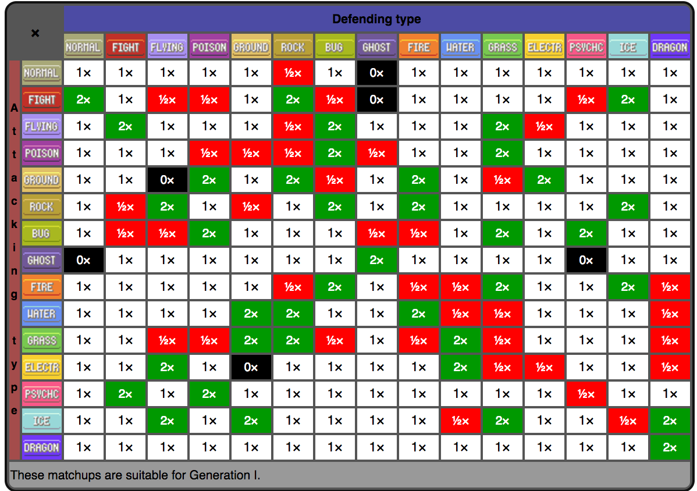
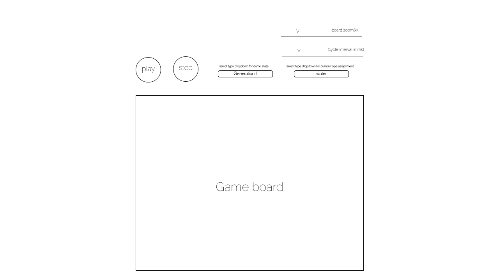

## PokeAutomata

### Introduction

PokeAutomata is a Pokemon battle themed **cellular automata** game. Each cell represents one of the 15 original Pokemon 'types'. In the Pokemon games and this battle simulator, a Pokemon's type determines the strength of its attacks on Pokemon of other types. (i.e. water beats fire, fire beats grass, grass beats water). The battle simulator will follow these rules:

1. Each pokeCell represents a Pokemon with an assigned type and 50 HP.

2. In each iteration, every pokeCell on the board 'battles' its eight neighbors, taking damage based on type advantages.
3. A pokeCell with 0 HP is replaced by a pokeCell with full HP and the type that dealt the previous pokeCell the most damage. Tiebreaker logic is handled by comparing type dominance, total damage dealt and count of neighbors of the same type.

PokeAutomata's type match-ups will follow this chart provided from Bulbapedia:

- 1x damage removes one hit point from the defending pokeCell, 2x removes two hit points and so on.

### Functionality & MVP  

With the PokeAutomata battle simulator, users will be able to:

- [ ] Start, pause, and reset the game board
- [ ] Assign types to pokeCells in the initial state
- [ ] Choose from preset demo states
- [ ] Adjust the speed of cycles and size of the board.

In addition, this project will include:

- [ ] An About modal describing the background and rules of the game
- [ ] A production README

### Wireframes

This app will consist of a single game view of the PokeBattleField, PokeBattleField controls
and the About modal.  Game controls will include Start, Stop, and Reset buttons as well as a slider to control the speed. Preliminary ideas for preset demo states include random type distribution and type distribution based on generation I Pokemon types.

### Architecture and Technologies

This project will be implemented with the following technologies:

- Vanilla JavaScript and `jQuery` for structure, game logic and interactivity.
- `Easel.js` with `HTML5 Canvas` for DOM manipulation and sprite rendering,
- Webpack to bundle and serve up the various scripts.

In addition to the webpack entry file, there will be three scripts involved in this project:

`poke_battlefield.js`: this script will handle the logic for creating and updating the necessary `Easel.js` elements and rendering them to the DOM. UI logic will live in this file as well.

`poke_automata.js`: this script will handle the Pokemon battle type match-up logic.  An Automata object will hold a defending pokeCell and a 2D array of neighboring attacking pokeCells.  It will be responsible calculating total damage taken in the cycle and applying it to the defending pokeCell.

`poke_cell.js`: this script will construct the pokeCell's stats including type and HP. It should also handle receiving damage results from the pokeAutomata.

### Implementation Timeline

**Day 1**:

- Set up modular file structure
- Get webpack bundling
- Take time to get reacquainted with Canvas and setup HTML and stylesheet files.
- Learn Easel.js to get a handle of far I can push this simulator visually   

**Day 2**:

- Design the pokeCell object's constructor
- Render a square grid to the `Canvas` using `Easel.js`
- Also render a square grid that is easy for testing
- Assign cells color
- Make cells interactive with type select dropdown and cell color toggle.

**Day 3**:

- Write out battle system logic in pokeAutomata
- Link pokeCell to pokeAutomata with functions that register damage
- Get board to re-render based on the new state in time intervals.

**Weekend**:

- Add the following controls to the UI:
  - Start, pause and stop simulation
  - Initial State demos
  - Step forward one cycle
  - Timeout interval slider
  - Board zoom
  - Polish type select drop-down and board-user interactivity.
- Don't forget to write an about modal!

### Bonus features

Here are some ideas to make this battle simulator more true to the actual games:

- [ ] Spice up the game logic with dual-type pokeCells.
- [ ] More demo simulations!
- [ ] Add generation II types
- [ ] Abstract pokeCells into individual Pokemon, building on top of the pokeAutomata logic accordingly.
- [ ] Inspect pokeCell tooltip
- [ ] Render game sprites instead of plain ol' cells.
