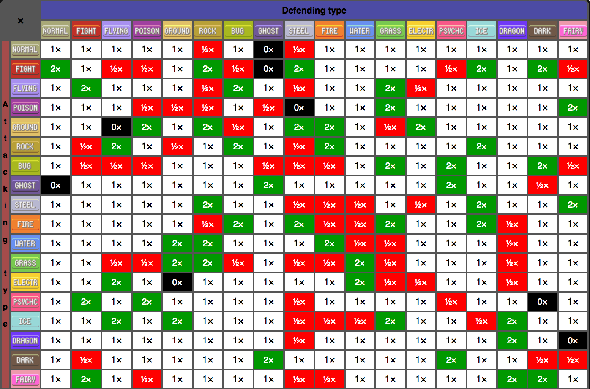
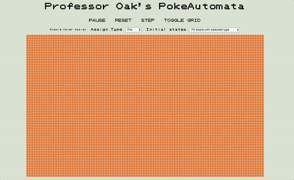

## PokeAutomata

### Introduction

PokeAutomata is a Pokemon battle themed **cellular automata** game. Each cell represents one of the 15 original Pokemon 'types'. In the Pokemon games and this battle simulator, a Pokemon's type determines the strength of its attacks on Pokemon of other types. (i.e. water beats fire, fire beats grass, grass beats water). The battle simulator will follow these rules:

1. Each pokeCell represents a Pokemon with an assigned type and 20 HP.

2. In each iteration, every pokeCell on the board 'battles' its eight neighbors, taking damage based on type advantages.
3. A pokeCell with 0 HP is replaced by a pokeCell with full HP and the type that dealt the last attack.

PokeAutomata's type match-ups will follow this chart provided from Bulbapedia:



- 1x damage removes one hit point from the defending pokeCell, 2x removes two hit points and so on.

###Screenshot


### Technologies

The PokeAutomata uses vanilla Javascript to implement the object-oriented game logic. jQuery DOM manipulation and Easel.js are coupled together to build a simple yet dynamic user interface. For example, the following functions allows users to assign types to pokeCells:

```javascript

//game_view.js
installHandlers(){
  this.stage.on('mouseover', this.handleAssign.bind(this))
  this.stage.on('click', this.handleAssign.bind(this))
}

handleAssign(){
  let clickPos = [this.stage.mouseX, this.stage.mouseY];

  let cellX = Math.floor((clickPos[0] - this.numRows % 2/2*this.squareSize)/this.squareSize);
  let cellY = Math.floor((clickPos[1] - this.numCols % 2/2*this.squareSize)/this.squareSize);
  this.pokeBattlefield.assignCell(cellX, cellY, this.typeToAssign);
  let clickedPokeCell = this.pokeBattlefield.grid[cellX][cellY]
  this.pokeBattlefield.drawCell(clickedPokeCell, this.stage, this.squareSize, cellX, cellY);
  this.stage.update();
}
```
```javascript
//poke_cell.js
assignCell(cellX, cellY, type){
  this.grid[cellX][cellY] = new pokeCell(type);
}
```





### Bonus features

Here are some ideas to make this battle simulator more true to the actual games and provide a more exciting experience:

- [ ] Spice up the game logic with dual-type pokeCells.
- [ ] More demo simulations!
- [ ] Add keybindings that enable users to assign a type to a large group of cells at once.
- [ ] Abstract pokeCells into individual Pokemon, building on top of the pokeAutomata logic accordingly.
- [ ] Inspect pokeCell tooltip.
- [ ] Render game sprites instead of just cell colors.
